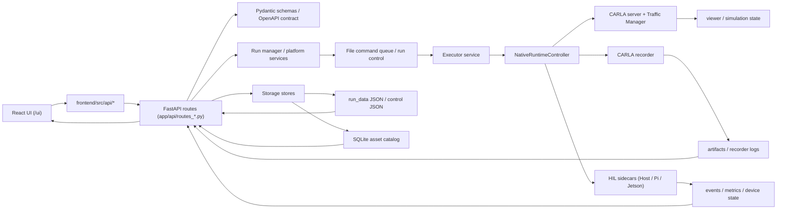
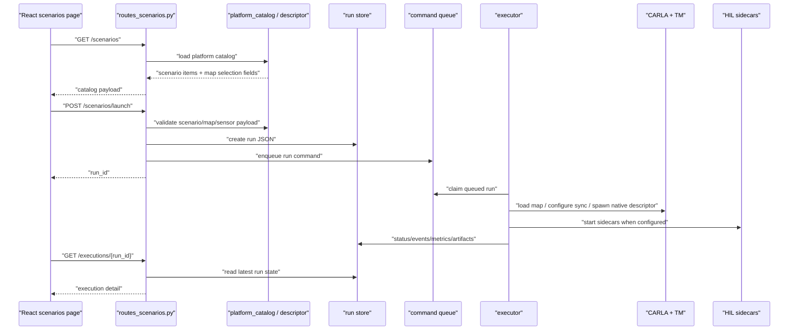
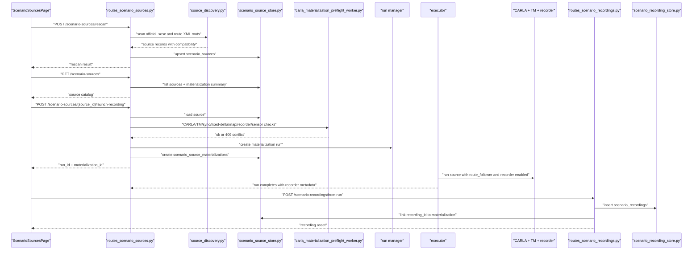
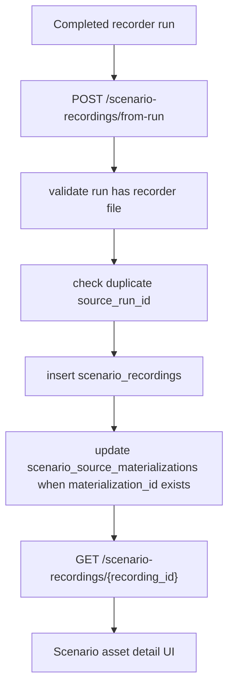
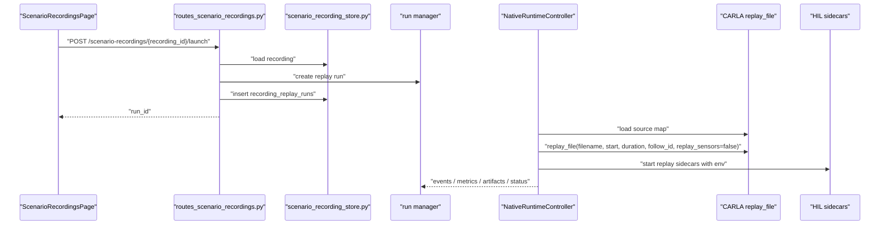
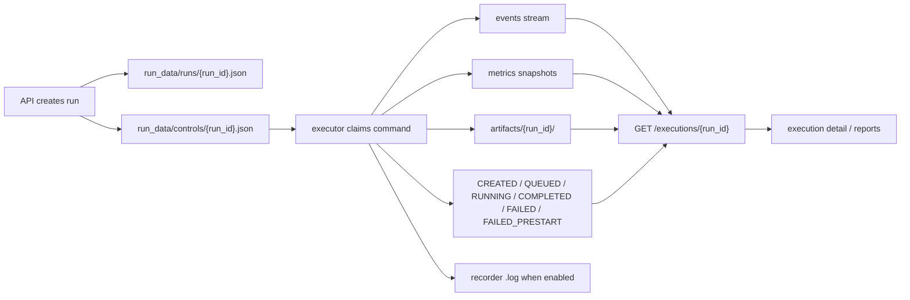
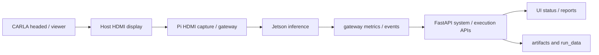
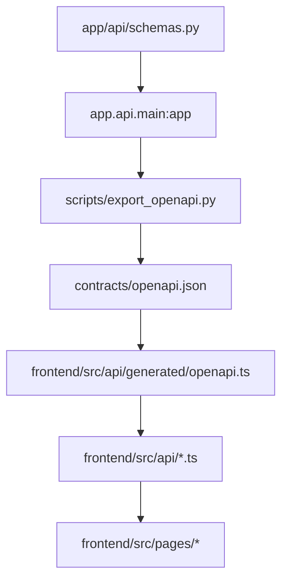

# 项目模块调用与数据流

## 1. 总体边界

SimChip Nexus / CARLA 芯片测评平台的核心边界保持为：

```text
frontend/src/pages/*
  -> frontend/src/api/*
  -> app/api/routes_*.py
  -> service / manager / store
  -> executor / gateway / runtime side effects
```

前端通过领域 API 模块访问 FastAPI。FastAPI routes 负责请求校验、响应组装和调用服务层；运行记录、场景源、场景资产和 replay 关联由 store 层持久化；executor / controller 负责 CARLA、Traffic Manager、recorder、HIL sidecar 等真实副作用。

## 2. 系统模块调用图



## 3. 主要代码模块

前端：

- `frontend/src/app/router.tsx`：页面路由入口。
- `frontend/src/components/layout/navigation.ts`：左侧导航和页面入口。
- `frontend/src/pages/scenarios/`：场景目录与 launch UI。
- `frontend/src/pages/executions/`：执行列表、执行详情、recorder 发布入口。
- `frontend/src/pages/scenario-sources/ScenarioSourcesPage.tsx`：公共场景源列表、过滤、rescan、launch-recording。
- `frontend/src/pages/scenario-recordings/`：场景资产库列表、过滤、详情、创建 replay run。
- `frontend/src/api/client.ts`：统一 HTTP client。
- `frontend/src/api/scenarioSources.ts`：公共场景源 API wrapper。
- `frontend/src/api/scenarioRecordings.ts`：场景资产库 API wrapper。
- `frontend/src/api/types.ts` 与 `frontend/src/api/generated/openapi.ts`：手写类型与 OpenAPI 生成类型。

后端 API：

- `app/api/main.py`：FastAPI app 与 router 注册。
- `app/api/schemas.py`：请求/响应模型。
- `app/api/routes_scenarios.py`：场景目录、地图列表、场景 launch。
- `app/api/routes_scenario_sources.py`：公共场景源 catalog、rescan、materialization history、launch-recording。
- `app/api/routes_scenario_recordings.py`：recorder 资产列表、发布、详情、replay launch。
- `app/api/carla_materialization_preflight_worker.py`：materialization 前 CARLA / TM / recorder 目录 preflight。

后端存储与模型：

- `app/core/models.py`：run、recording、source、materialization 等核心数据模型。
- `app/core/config.py`：路径、CARLA、source root、recording root 等配置入口。
- `app/storage/scenario_source_store.py`：SQLite `scenario_sources` 和 `scenario_source_materializations`。
- `app/storage/scenario_recording_store.py`：SQLite `scenario_recordings` 和 `recording_replay_runs`。
- `run_data/`：run JSON、control JSON、SQLite asset catalog 和运行态持久数据。
- `artifacts/`：运行产物、recorder log、metrics、events 等文件型证据。

runtime / executor：

- `app/scenario/platform_catalog.py`：平台场景目录与内部 materialization 模板。
- `app/scenario/source_discovery.py`：ScenarioRunner `.xosc`、Leaderboard / Bench2Drive route XML discovery。
- `app/scenario/descriptor.py`：场景 descriptor 构建与解析。
- `app/executor/recorder.py`：CARLA recorder 启停封装。
- `app/executor/native_runtime_controller.py`：native runtime、recorder replay、spawn / replay 控制主链。
- `app/executor/hil_runtime_orchestrator.py`：HIL sidecar 环境变量和生命周期。
- `hil_runtime/`：Host / Pi / Jetson 侧脚本和采集/显示/推理链路。

## 4. 场景目录启动链路



关键规则：

- `fixed` 地图场景忽略用户传入地图，使用 `default_map_name`。
- `subset` 场景只允许 `allowed_map_names` 与 `/scenarios/maps` 可用地图交集。
- `all` 场景允许选择任意 CARLA 可用地图。
- sensor template 仍然是全局可选，不与地图绑定。

## 5. 公共场景源 Materialization 链路

公共场景源不是可直接测评的最终资产。v1 将公共定义先在本平台 CARLA、sensor profile、fixed-delta 和 materialization agent 下重物化为 recorder run，再发布为可回放场景资产。



v1 provider 范围：

- ScenarioRunner 官方已验证 `.xosc` baseline。
- Leaderboard / Bench2Drive route XML，按 XML 内每个 route 生成一个 source item。

v1 不做：

- SafeBench、Casezoo、3CSim provider。
- 自动下载外部 repo。
- 完整 Leaderboard scoring。
- 多 agent benchmark。
- 自动 corner-case 时间窗切片。

## 6. Recorder 资产发布链路



`scenario_recordings` 保存最终资产，不把 provider 原始字段全部塞入资产表，只保留 source lineage 引用：

- `recording_id`
- `source_run_id`
- `source_id`
- `source_provider`
- `materialization_id`
- `map_name`
- `scenario_name`
- `recorder_log_path`
- `file_size_bytes`
- `tags_json`
- `corner_case_labels_json`
- `weather_json`
- `traffic_density`
- `sensor_profile_name`
- `determinism_level`
- `created_at`

重复发布同一个 `source_run_id` 返回已有资产，避免同一 run 产生多个不可区分的 recording。

当前风险：recorder API 状态事件不等同于 `.log` 文件已经落盘。发布前必须确认 recorder 文件在平台可见路径真实存在，并且 CARLA 容器与 executor 容器共享该路径。

## 7. Replay Run 链路



Replay run 的 `scenario_source.launch_mode` 固定为 `carla_recorder_replay`。v1 replay 语义：

- 不执行 native descriptor spawn plan。
- 加载来源地图。
- 调用 CARLA `replay_file` 分段回放。
- 使用 `replay_sensors=false`。
- 平台按来源 sensor profile 重新挂载 CARLA live sensors。
- 强制 synchronous/fixed-delta。
- HIL sidecar 环境变量包含 recording id、source log、start/duration、fixed delta、sensor mode。

Replay payload 固定关注：

- `start_seconds`
- `duration_seconds`
- `sensor_mode="carla_live"`
- `fixed_delta_seconds`
- `auto_start`
- `metadata`

## 8. Run 状态、事件与产物流



状态语义：

- `CREATED`：API 已创建 run 记录。
- `QUEUED`：run 已入队，等待 executor。
- `RUNNING`：executor 已进入 runtime 主流程。
- `COMPLETED`：运行完成；仍需检查关键 artifact 是否实际存在。
- `FAILED`：运行阶段失败。
- `FAILED_PRESTART`：controller 阶段预启动失败，例如 TM connect timeout，不能进入 `RUNNING`。

Materialization 的 preflight 失败返回 `409`，不创建 queued run，避免污染运行队列。

## 9. 数据存储说明

文件型数据：

- `run_data/runs/`：run JSON 状态、metadata、scenario source、recorder state。
- `run_data/controls/`：executor command / control JSON。
- `artifacts/{run_id}/`：运行产物、日志、metrics、events、recorder 文件。
- `contracts/openapi.json`：FastAPI OpenAPI 导出快照。
- `frontend/src/api/generated/openapi.ts`：OpenAPI 生成的前端类型。

SQLite 数据：

- 默认数据库路径：`run_data/scenario_recordings/scenario_recordings.sqlite3`
- `scenario_sources`：公共场景源 catalog。
- `scenario_source_materializations`：source -> materialization run -> recording asset 关联。
- `scenario_recordings`：最终可回放 recorder 资产。
- `recording_replay_runs`：recording asset -> replay run 关联。

推荐原则：

- source table 保存 provider、source path/hash、route id、map、weather、compatibility、parsed metadata。
- materialization table 保存 materialization lineage、run id、recording id、sensor profile/hash、fixed delta、agent type/hash、recorder sha256 和错误信息。
- recording table 保存最终资产和最小 source lineage 引用，不重复塞满 provider 原始字段。

## 10. HIL 与设备链路

HIL 链路的职责是把仿真输入、显示采集、设备推理、指标和事件带回平台：



Replay 场景下，HIL sidecar 需要明确收到 replay 上下文，避免芯片测评只知道“有一条 run”而无法审计输入来源：

- `DUCKPARK_HIL_REPLAY_MODE=carla_recorder_replay`
- recording id
- source recorder log path
- replay start seconds
- replay duration seconds
- fixed delta seconds
- sensor mode

## 11. API Contract 数据流



接口改动的最小闭环：

1. 修改 `app/api/schemas.py` 和相关 route payload。
2. 修改 `frontend/src/api/*.ts` wrapper 和 `frontend/src/api/types.ts`。
3. 修改或新增 `tests/test_api_*.py`。
4. 执行 `make contract-sync`。
5. 执行后端测试、`npm run check-types`、`npm run build`。

不要在页面组件里重新定义 server payload 类型；页面应消费领域 API wrapper 返回的数据。

## 12. 当前能力边界

已实现或正在使用的能力：

- 平台 native scenario launch。
- 场景语义 + 适用地图集合。
- 公共场景源 catalog、rescan、materialization run。
- ScenarioRunner 官方 `.xosc` baseline discovery。
- Leaderboard / Bench2Drive route XML 单 route source discovery。
- SQLite 场景资产库。
- 从 recorder run 发布 scenario recording。
- 从 scenario recording 创建 `carla_recorder_replay` run。
- replay fixed-delta、CARLA live sensors、HIL replay env。

v1 明确不包含：

- 任意第三方 OpenSCENARIO 完整兼容承诺。
- SafeBench / Casezoo / 3CSim provider。
- 自动下载 Bench2Drive / Leaderboard repo。
- 完整 Leaderboard scoring runner。
- 多 materialization agent 对比评测。
- 自动 collision / infraction 时间窗切片。
- recorded sensor dataset 重放。

当前待收敛风险：

- CARLA recorder `.log` 文件落盘仍依赖 CARLA server 容器、executor 容器、主机之间的共享路径和权限。
- `COMPLETED` run 不等价于 recorder asset 可发布，发布前必须检查文件存在和可读。
- 同一公共 source 在不同 CARLA 版本、sensor profile、fixed delta、materialization agent 下重物化会形成不同 lineage，不能混作同一实验资产。

